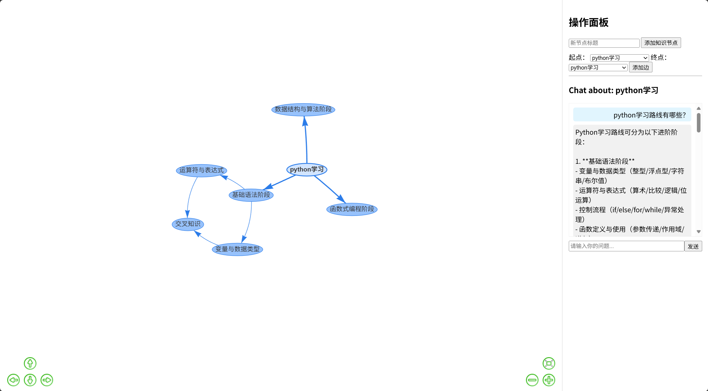
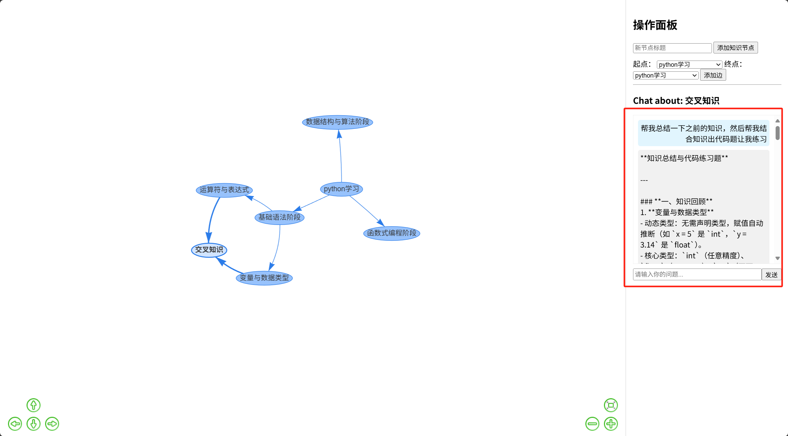

# 项目演示文档

## 1. 启动后端服务

进入 `backend` 目录，安装依赖并启动 FastAPI 服务：

```bash
uvicorn main:app --reload
```

启动成功后，终端会显示类似：

```
Uvicorn running on http://127.0.0.1:8000
```

---

## 2. 启动前端页面

进入 `frontend` 目录，直接用浏览器打开 `index.html` 文件。

---

## 3. 主要功能演示

### 3.1 知识图谱可视化

- 页面左侧展示知识图谱结构，节点代表知识点，边代表知识点之间的关系。
- 可通过鼠标拖拽、缩放等方式自由浏览知识结构。

### 3.2 新增知识节点

1. 在右侧"操作面板"输入新节点标题，点击"添加知识节点"按钮。
2. 新节点会自动添加到图谱中。

### 3.3 新增知识关系（边）

1. 在"起点"和"终点"下拉框中选择两个节点。
2. 点击"添加边"按钮，即可在两个节点间建立知识关系。

### 3.4 节点智能对话

1. 点击图谱中的任意节点，右侧会显示该节点的对话面板。
2. 在输入框输入你的问题，点击"发送"。
3. 系统会基于该知识节点及其上下文，返回智能回答，并自动记录对话历史。

### 3.5 对话历史查看

- 每个节点的历史对话会自动保存，点击节点即可查看与该知识点相关的所有问答记录。

---

## 4. 示例演示流程

1. 启动后端和前端。
2. 在前端页面添加"python学习"节点(自己想学习的知识的名称)，聊天学习相关知识
3. 如果有了大纲想，分散学习，继续添加"基础语法阶段""数据结构与算法阶段"等子节点。
4. 可以通过添加边来连接这些节点，形成完整的知识结构图。
5. 选择"python学习"节点，输入"如何高效学习Python？"并发送，查看智能回答。
6. 多次点击不同节点，体验上下文相关的智能问答和历史记录。
7. 也可以连接两个知识节点，比如"基础语法阶段""数据结构与算法阶段"，输入问题，查看智能回答。

---

## 5. 效果截图




知识点交叉对话示例：
